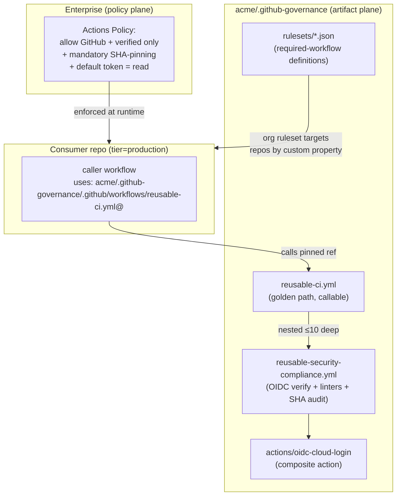
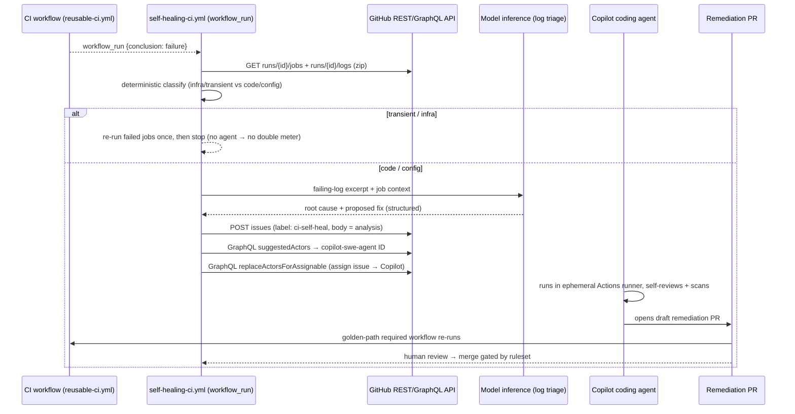
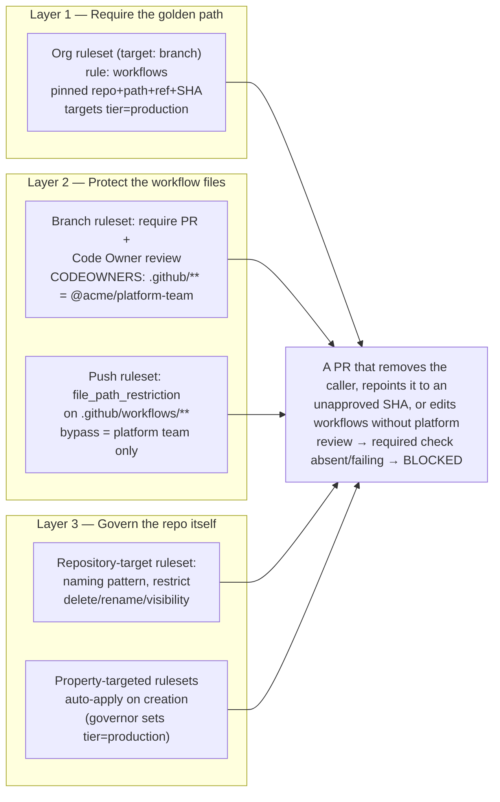

# High-Impact Use Cases & PoCs — Golden Paths, Self-Healing CI, Workflow Enforcement

**Companion scaffold:** `src/` (runnable `.github` tree referenced throughout)
**Convention used below:** the central governance repository is `acme/.github-governance`; consumer repositories are the application repos that *call* the golden path.

This document specifies three production-grade scenarios. Each section gives (1) the architecture, (2) the exact GitHub mechanisms — APIs, webhook **events**, Actions **hooks** — and (3) the key code. Full files live in the companion scaffold so they are committable as-is.

---

## Scenario A — The Golden Path & Action Governance

**Goal:** A central governance team restricts the enterprise to allowed/verified actions only (SHA-pinned), and *mandates* security/compliance jobs (OIDC verification, required linters, provenance) on every repo via reusable workflows — without copy-pasting YAML into hundreds of repos.

### A.1 Architecture



Two planes do the work: a **policy plane** (enterprise/org settings that *constrain* what any workflow may do) and an **artifact plane** (versioned reusable workflows the platform team *ships*). Rulesets bind them by *requiring* the artifact on repos selected by custom property.

### A.2 Enterprise/Org action-catalog governance (the policy plane)

Set at **Enterprise → Policies → Actions** (cascades to orgs), or per-org. Three controls matter:

**1. Restrict which actions can run.** Choose *"Allow enterprise, and select non-enterprise, actions and reusable workflows"* → enable **GitHub-authored** + **verified creators**, then add an explicit allow-list for anything else. API (org scope):

```bash
# Set policy to "selected" actions only
gh api -X PUT /orgs/ACME/actions/permissions \
  -f enabled_repositories='all' \
  -f allowed_actions='selected'

# Define the allow-list: GitHub-authored, verified creators, and pinned exceptions
gh api -X PUT /orgs/ACME/actions/permissions/selected-actions \
  -F github_owned_allowed=true \
  -F verified_allowed=true \
  -f 'patterns_allowed[]=acme/*' \
  -f 'patterns_allowed[]=aws-actions/configure-aws-credentials@*'
```

**2. Mandate SHA-pinning (Aug 2025 capability).** In the same allowed-actions policy, enable **"Require actions to be pinned to a full-length commit SHA."** Any workflow that references an action by tag/branch (e.g., `actions/checkout@v4`) instead of a 40-char SHA **fails at evaluation**. This applies to *all* actions, including GitHub-authored and your own enterprise actions — it is the single highest-leverage supply-chain control because it neutralizes mutable-tag attacks.

**3. Lock down the default `GITHUB_TOKEN`.** Force least privilege org-wide so a compromised or careless workflow starts read-only:

```bash
gh api -X PUT /orgs/ACME/actions/permissions/workflow \
  -F default_workflow_permissions='read' \
  -F can_approve_pull_request_reviews=false
```

Workflows then *opt up* per-job with explicit `permissions:` blocks 

### A.3 The golden-path reusable workflow (the artifact plane)

`reusable-ci.yml` is `workflow_call`-able and composes the mandatory compliance jobs. Consumers call it in ~6 lines; all real logic is central and versioned. Key design points (full file: `src/.github/workflows/reusable-ci.yml`):

- **Inputs with guardrails:** `runner` input constrained to an allow-list (defaults to `ubuntu-latest`, the `$0.006`/min tier) so teams can't silently default to expensive large/macOS runners.
- **Mandatory nested compliance job:** calls `reusable-security-compliance.yml` (nesting depth 2 of the allowed 10). That nested workflow runs: **actionlint** (workflow correctness), **zizmor** (workflow *security* SAST — detects `pull_request_target` foot-guns, injection, over-broad permissions), a **SHA-pin audit** (defense-in-depth even though policy enforces it), **secret-scanning gate**, and **build provenance attestation**.
- **Cost hygiene baked in:** top-level `concurrency` with `cancel-in-progress: true`, `timeout-minutes` on every job, `actions/cache`. Fixing cost once here fixes it everywhere.

```yaml
# Consumer side — the entire CI a product team must write (caller-example.yml):
name: CI
on:
  pull_request:
  push: { branches: [main] }
permissions:
  contents: read          # least privilege; the reusable WF opts up where needed
jobs:
  ci:
    uses: acme/.github-governance/.github/workflows/reusable-ci.yml@<40-char-SHA>
    with:
      language: node
      runner: ubuntu-latest
    secrets: inherit
```

### A.4 OIDC verification as a mandatory job (composite action)

The `oidc-cloud-login` composite action (`src/actions/oidc-cloud-login/action.yml`) standardizes keyless cloud auth and *verifies* it — no long-lived cloud secrets anywhere. It requires `permissions: id-token: write`, exchanges the GitHub OIDC token for short-lived cloud credentials, and asserts the resulting identity. The AWS trust policy must scope the `sub` claim tightly:

```json
// IAM trust policy condition — NEVER use repo:acme/*:* wildcards
"Condition": {
  "StringEquals":   { "token.actions.githubusercontent.com:aud": "sts.amazonaws.com" },
  "StringLike":     { "token.actions.githubusercontent.com:sub": "repo:acme/payments-api:environment:production" }
}
```

### A.5 Binding artifact → repo via required workflows + custom properties

Define an org **custom property** (e.g., `tier` ∈ {sandbox, internal, production}) once, set it on repos (your existing self-service governor should set it at provisioning time), then attach an org **ruleset** that *requires* the golden path on every `tier=production` repo — pinned to an exact SHA. See Scenario C for the ruleset JSON and the enforcement semantics; the binding is what makes the golden path **non-optional** rather than merely available.

### A.6 "Mandatory workflow compilation / compliance check"

The stakeholder requirement for *"mandatory workflow compilation"* maps to a **policy-as-code compliance gate**: a required job that statically validates every workflow before it can merge. The scaffold ships `policy/workflow-compliance.rego` (OPA/conftest) asserting, e.g., "all `uses:` are SHA-pinned," "no `pull_request_target` with checkout of head ref," "top-level `permissions` present and minimal," "`runs-on` ∈ allow-list." Run it as a required check in `reusable-security-compliance.yml`.

---

## Scenario B — Self-Healing CI

**Goal:** A pipeline failure triggers AI log analysis, which interacts with the GitHub API to diagnose root cause and — for code/config failures only — hands the fix to the Copilot **coding agent**, which opens a remediation PR. The PR then re-runs the golden path and is merge-gated by the same rulesets.

### B.1 Why a separate orchestrator workflow

The remediation logic lives in its own workflow triggered by **`workflow_run`**, *not* inside the CI workflow. This is deliberate and security-critical:

- `workflow_run` executes **from the default branch** with repo-scoped permissions, *decoupled* from the (potentially untrusted) PR that failed. It never checks out untrusted head code with a privileged token — sidestepping the classic `pull_request_target` privilege-escalation class.
- It can carry the elevated `permissions` (issues: write, contents: write, pull-requests: write) needed to file issues and assign the agent, while the CI workflow itself stays read-only.

### B.2 End-to-end sequence



### B.3 The mechanisms, step by step

**1. Trigger (`workflow_run` event + `conclusion` filter).**

```yaml
on:
  workflow_run:
    workflows: ["CI"]      # name of the caller workflow
    types: [completed]
permissions:
  contents: read
  actions: read            # read logs/jobs of the triggering run
  issues: write            # file the self-heal issue
jobs:
  triage:
    if: ${{ github.event.workflow_run.conclusion == 'failure' }}
    runs-on: ubuntu-latest
```

**2. Retrieve logs & job context (REST).** Use the run ID from the event payload (`github.event.workflow_run.id`):

```bash
RUN_ID=${{ github.event.workflow_run.id }}
# Per-job status (to find WHICH step failed)
gh api /repos/$GITHUB_REPOSITORY/actions/runs/$RUN_ID/jobs --jq \
  '.jobs[] | select(.conclusion=="failure") | {name, steps: [.steps[] | select(.conclusion=="failure")]}'
# Full logs (zip of all job logs)
gh api /repos/$GITHUB_REPOSITORY/actions/runs/$RUN_ID/logs > logs.zip
```

**3. Deterministic pre-classification (cost gate).** Before spending *any* AI/agent budget, regex-classify the failing log: network timeouts, runner pre-emption, rate limits, registry 5xx → **transient** → re-run failed jobs once (`gh run rerun $RUN_ID --failed`) and exit. Compile/test/lint/type errors, missing deps, config drift → **code/config** → proceed. This is the [§3.3 *double-meter* guard](strategic-financial-evaluation.md#33-the-coding-agents-double-cost-critical) from the financial doc: never wake the agent (Actions minutes **+** AI tokens) for a flaky network blip.

**4. AI log analysis.** Send the *failing excerpt* (not the whole zip — token economy) plus job/step context to a model, requesting structured output: `{root_cause, confidence, files_likely_involved[], proposed_fix_summary}`. Keep routine triage on a smaller/cheaper model; escalate model size only on low confidence.

**5. File a structured issue (REST).**

```bash
gh api -X POST /repos/$GITHUB_REPOSITORY/issues \
  -f title="[self-heal] CI failure on $HEAD_BRANCH: $SHORT_CAUSE" \
  -f body="$ANALYSIS_MARKDOWN" \
  -f 'labels[]=ci-self-heal'
```

**6. Hand the issue to the Copilot coding agent (GraphQL).** First confirm the agent is enabled for the repo by checking `suggestedActors` — the agent surfaces as the bot login **`copilot-swe-agent`** — then assign it. The assignment API requires a **user-scoped token** (PAT or GitHub App user-to-server token) and the feature header.

```graphql
# (a) Find the Copilot bot's node ID
query($owner:String!, $name:String!) {
  repository(owner:$owner, name:$name) {
    suggestedActors(capabilities:[CAN_BE_ASSIGNED], first:5) {
      nodes { login __typename ... on Bot { id } }
    }
  }
}
# (b) Assign the issue to Copilot
mutation($assignableId:ID!, $actorId:ID!) {
  replaceActorsForAssignable(input:{assignableId:$assignableId, actorIds:[$actorId]}) {
    assignable { ... on Issue { number assignees(first:5){ nodes { login } } } }
  }
}
```

```bash
# Required header (GA'd via the issues_copilot_assignment_api_support feature):
gh api graphql \
  -H "GraphQL-Features: issues_copilot_assignment_api_support,coding_agent_model_selection" \
  -f query="$ASSIGN_MUTATION" -F assignableId="$ISSUE_NODE_ID" -F actorId="$COPILOT_BOT_ID"
```

> Since the **Dec 2025** changelog there is also a REST path to assign issues to Copilot (with target repo, base branch, and custom instructions). The scaffold's `self-healing-ci.yml` uses GraphQL for broad availability; swap to REST if your org has it enabled.

**7. Agent executes & opens a PR.** The coding agent spins up an **ephemeral GitHub Actions runner**, branches, applies the fix, runs tests, **self-reviews its own diff**, and runs the three-layer security scan (CodeQL, secret scanning, dependency review) before opening a **draft** PR linked to the issue. You can steer it with a repo-level `copilot-instructions.md` and per-issue custom instructions.

**8. Re-validation & merge gate.** The remediation PR triggers the **golden-path required workflow** (Scenario A). Merge is blocked until that passes *and* a human approves — the agent **cannot** bypass the rulesets (it has no place on bypass lists). Human-in-the-loop is preserved by construction.

### B.4 Cost & safety controls (non-negotiable)

- **Classification gate** (step 3) prevents double-meter waste on transient failures.
- **Concurrency cap** on the orchestrator (`concurrency: self-heal-${{ github.event.workflow_run.head_branch }}`, `cancel-in-progress: true`) prevents agent storms.
- **Label/loop guard:** don't self-heal a PR that's already a `ci-self-heal` remediation (prevents infinite agent recursion).
- **Least privilege:** orchestrator carries write scopes; the CI workflow does not. The agent's PR is always **draft + required-review**.

---

## Scenario C — Workflow Enforcement (block bypass of corporate CI standards)

**Goal:** Use **Repository Rulesets** (org-scoped, custom-property-targeted) so a PR — or a newly-provisioned repo — **cannot** alter or bypass the corporate CI standard. Three layers stack into a non-bypassable control.

### C.1 Enforcement layering



### C.2 Layer 1 — *Require* the golden path (required workflows via ruleset)

Required workflows are now a **Repository Ruleset rule type** (`workflows`), GA. The workflow is pinned to an exact repo + path + ref + **SHA**, so consumers can't silently run an old or forked version. Target the ruleset at production repos **by custom property** so it scales without enumerating repos. Create at org scope:

```bash
gh api -X POST /orgs/ACME/rulesets --input rulesets/org-require-golden-path.json
```

```json
{
  "name": "require-golden-path-ci",
  "target": "branch",
  "enforcement": "active",
  "conditions": {
    "ref_name":   { "include": ["~DEFAULT_BRANCH"], "exclude": [] },
    "repository_property": {
      "include": [ { "name": "tier", "property_values": ["production"], "source": "custom" } ]
    }
  },
  "rules": [
    {
      "type": "workflows",
      "parameters": {
        "workflows": [
          {
            "repository_id": 987654321,
            "path": ".github/workflows/reusable-ci.yml",
            "ref": "refs/heads/main",
            "sha": "0a1b2c3d4e5f60718293a4b5c6d7e8f901234567"
          }
        ]
      }
    }
  ],
  "bypass_actors": []
}
```

Because `bypass_actors` is empty, **no one** — not even org admins or the Copilot agent — merges to a `tier=production` default branch without this workflow passing. Roll out with `"enforcement": "evaluate"` first (dry-run) to measure blast radius, then flip to `"active"`.

### C.3 Layer 2 — *Protect* the workflow files (so the caller can't be gutted)

Requiring a workflow is insufficient if a team can simply edit/delete the caller. Two complementary rules:

**(a) Code-owner review (primary).** A branch ruleset requiring a pull request **and** Code Owner approval, with `CODEOWNERS` assigning workflow paths to the platform team:

```
# .github/CODEOWNERS  (in every consumer repo, itself seeded by the governor)
/.github/**            @acme/platform-team
/.github/workflows/**  @acme/platform-team
```

Any PR touching the caller or CODEOWNERS now requires platform-team sign-off — a developer cannot unilaterally repoint the `uses:` SHA or remove the job.

**(b) Hard path lock (defense in depth).** A **push ruleset** with `file_path_restriction` blocks modifications to workflow paths outright, with the platform team on the bypass list:

```json
{
  "name": "protect-workflow-files",
  "target": "push",
  "enforcement": "active",
  "conditions": {
    "repository_property": {
      "include": [ { "name": "tier", "property_values": ["production"], "source": "custom" } ]
    }
  },
  "rules": [
    {
      "type": "file_path_restriction",
      "parameters": { "restricted_file_paths": [".github/workflows/**", ".github/CODEOWNERS"] }
    }
  ],
  "bypass_actors": [
    { "actor_id": 4242, "actor_type": "Team", "bypass_mode": "always" }
  ]
}
```

Layered with Layer 1, a PR that removes the caller, repoints it to an unapproved SHA, or edits workflow files without platform review will **fail the required check or be blocked at push** — the corporate CI standard cannot be bypassed.

### C.4 Layer 3 — Govern the repository itself (creation & metadata)

Two mechanisms close the "create a non-compliant repo" gap:

1. **Property-targeted inheritance (the real guarantee).** Because the Layer 1/2 rulesets target `tier=production`, *any* repo that has — or is given — that property **automatically inherits** them. Your existing self-service provisioning governor sets `tier` at creation time, so there is **no window** in which a production repo exists without the required golden path. New repo ⇒ compliant by construction.

2. **Repository-target rulesets** (`target: "repository"`) govern the repo's own metadata — enforce a naming convention and restrict rename/delete/visibility so a repo can't be mutated *out* of the property scope to dodge controls:

```json
{
  "name": "repo-metadata-guardrails",
  "target": "repository",
  "enforcement": "active",
  "conditions": { "repository_name": { "include": ["~ALL"], "exclude": [] } },
  "rules": [
    { "type": "repository_name",
      "parameters": { "operator": "regex", "pattern": "^(svc|app|lib)-[a-z0-9-]+$", "negate": false } }
  ]
}
```

Pair with org **member privileges**: disable ad-hoc repo creation / public-repo creation so the governor remains the only sanctioned provisioning path.

### C.5 Monitoring the controls (don't let enforcement rot)

- **Audit-log streaming** to SIEM on ruleset edits, bypass usage, and member-privilege changes.
- A scheduled **compliance-scan reusable workflow** asserting every `tier=production` repo (a) is attached to the required ruleset, (b) calls the approved SHA, (c) has zero unpinned actions — emitting drift as issues. (See [`strategic-financial-evaluation.md` §6](strategic-financial-evaluation.md#6-compliance-monitoring-closing-the-loop).)

---

## References

- Enforcing code reliability by requiring workflows with repository rules — https://github.blog/enterprise-software/ci-cd/enforcing-code-reliability-by-requiring-workflows-with-github-repository-rules/
- Creating rulesets for repositories in your organization — https://docs.github.com/en/enterprise-cloud@latest/organizations/managing-organization-settings/creating-rulesets-for-repositories-in-your-organization
- Available rules for rulesets — https://docs.github.com/en/enterprise-cloud@latest/repositories/configuring-branches-and-merges-in-your-repository/managing-rulesets/available-rules-for-rulesets
- GitHub Actions policy now supports blocking and SHA pinning actions — https://github.blog/changelog/2025-08-15-github-actions-policy-now-supports-blocking-and-sha-pinning-actions/
- Enforcing policies for GitHub Actions in your enterprise — https://docs.github.com/en/enterprise-cloud@latest/admin/enforcing-policies/enforcing-policies-for-your-enterprise/enforcing-policies-for-github-actions-in-your-enterprise
- Using GitHub Copilot to work on an issue (coding agent) — https://docs.github.com/en/enterprise-cloud@latest/copilot/how-tos/use-copilot-agents/coding-agent/assign-copilot-to-an-issue
- Assign issues to Copilot using the API — https://github.blog/changelog/2025-12-03-assign-issues-to-copilot-using-the-api/
- Configuring OpenID Connect in Amazon Web Services — https://docs.github.com/actions/security-for-github-actions/security-hardening-your-deployments/configuring-openid-connect-in-amazon-web-services
- Reusing workflow configurations (nesting limits) — https://docs.github.com/en/actions/reference/workflows-and-actions/reusing-workflow-configurations
